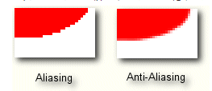

# draw和canvas，paint详解

对应的github地址：https://github.com/cowthan/UI-Robot


源码的使用文档：

DemoBase是每个Demo Activity的基类，主要负责：

```java
1 创建Test View，基类是BaseView
@Override
protected BaseView createTestView() {
    //初始化notify条
    setNotify("");
    
    //是否显示左右TouchBoard
    enableLeftTouchBoard(false);
    enableRightTouchBoard(false);
    
    //设置Test View的背景，其实设置的父控件FrameLayout的背景，默认透明，但有时透明看效果不太好
    setTestViewBackgroundStroke(); //给个线框包围四周
    setTestViewBackgroundFill(int bgColor); //设置背景填充
    //这俩冲突
    
    //返回Test View
    return new ColorView(getActivity());
}

2 控制Test View的点击，滑动，左右TOuchBoard的点击，滑动


3 获取Test View
getTestView();

4 横条提示
setNotify(String s)

5 观察Test View的事件变化，配合setNotify

getTestView().getObservable().addObserver(new Observer(){
    
});


```

# Canvas和Paint详解

本文的内容是Canvas和Paint，是本人的学习笔记，主要是为了方便日后好查  

* 配套的还有：
    * anim系列
    * touch和scroll系列
    * api demo系列-----这里面的东西会分到各个其他系列里
    * 安卓自带控件系列，包括原生，material系列，常用第三方库系列，这个比较大
    * Camera Preview引出的SurfaceView，TextureView，OpenGL系列，这个太深
    * 学完这一套，在安卓特效方面就能独霸天下，天惨地愁

安装demo apk：  


本文对应的代码都在：  
https://github.com/cowthan/UI-Robot

# 1 关于onDraw

## 1.1 16ms和掉帧的问题

得知道16ms一帧的问题，如果渲染一帧超过16ms，如用了20ms渲染，下一帧的切换就来不及，这一帧就持续了32ms，就出现了掉帧，掉帧多了，用户就会感觉到界面卡顿

## 1.2 onDraw基本套路

* 不要在onDraw里new可以重用的对象，onDraw里的性能必须严格考虑

```java
/**
 * 自定义控件：绘制一个圆环
 */
public class CustomView1 extends View{

    private Paint mPaint;

    public CustomView1(Context context) {
        super(context);
        initPaint();
    }

    public CustomView1(Context context, AttributeSet attrs) {
        super(context, attrs);
        initPaint();
    }

    public CustomView1(Context context, AttributeSet attrs, int defStyleAttr) {
        super(context, attrs, defStyleAttr);
        initPaint();
    }

    @TargetApi(Build.VERSION_CODES.LOLLIPOP)
    public CustomView1(Context context, AttributeSet attrs, int defStyleAttr, int defStyleRes) {
        super(context, attrs, defStyleAttr, defStyleRes);
        initPaint();
    }

    private void initPaint(){
        mPaint = new Paint(Paint.ANTI_ALIAS_FLAG);
        /*
         * 设置画笔样式为描边，圆环嘛……当然不能填充不然就么意思了
         *
         * 画笔样式分三种：
         * 1.Paint.Style.STROKE：描边
         * 2.Paint.Style.FILL_AND_STROKE：描边并填充
         * 3.Paint.Style.FILL：填充
         */
        mPaint.setStyle(Paint.Style.STROKE);

        // 设置画笔颜色为浅灰色
        mPaint.setColor(Color.LTGRAY);

        /*
         * 设置描边的粗细，单位：像素px，默认0
         * 注意：当setStrokeWidth(0)的时候描边宽度并不为0而是只占一个像素
         */
        mPaint.setStrokeWidth(10);

    }

    @Override
    protected void onDraw(Canvas canvas) {
        super.onDraw(canvas);

        // 绘制圆环
        canvas.drawCircle(Display.screenWidth / 2, Display.screenHeight / 2, radius, mPaint);

    }

	private float radius = 50;

    public void setRadius(float r){
        this.radius = r;
        if(this.radius >= 150) this.radius = 50;
        postInvalidate();
    }
}
```
* 效果就是画了一个圆环，至于padding和wrap_content的考虑，请参考上一篇文章
* 如果你在外部用动画或者其他方式不断调用setRadius，圆环就动起来了

* 这里注意invalidate和postInvalidate，还有requestLayout
	* invalidate：当前View重绘，只能在UI线程调用
	* postInvalidate：当前View重绘，不管在哪个线程调用，都在UI线程执行
	* requestLayout：请求父控件重新measure和layout，当然此控件本身也会重绘

可惜这里没图


# 2 入门 

canvas是纸，paint是笔  

下面先来说说Paint的基本设置，复杂的会放到后面细说。

```java
Paint mPaint = new Paint();

///---抗锯齿
paint.setAntiAlias(true);
或者mPaint = new Paint(Paint.ANTI_ALIAS_FLAG);
抗锯齿，让图像边缘显得更圆滑光泽动感的算法
抗锯齿，锯齿是依赖于算法的，算法决定抗锯齿的效率，在我们绘制棱角分明的图像时，比如一个矩形、一张位图，我们不需要打开抗锯齿

///---抗抖动
mPaint.setDither(false);
抗抖动，使颜色的过渡更柔和

///---设置颜色
mPaint.setAlpha(255);  //[0..255]
mPaint.setARGB(a, r, g, b);  // 和setColor一样，这里每个值都是(0..255)
mPaint.setColor(Color.BLUE);


///---线框风格
mPaint.setStyle(Paint.Style style);
Paint.Style.FILL    填充
Paint.Style.STROKE   画边框
Paint.Style.FILL_AND_STROKE 即填充，也画边框

///---线条宽度
mPaint.setStrokeWidth(10); //px，默认是0，但0不是看不见，而是占一个像素

///---笔的倾斜度
mPaint.setStrokeMiter(20);  //是设置笔画的倾斜度，如：小时候用的铅笔，削的时候斜与垂直削出来的笔尖效果是不一样的

///---笔触
//设置笔触的样式：影响画笔的始末端，你画一条line，然后增加strokeWidth，笔触就能明显看出来
mPaint.setStrokeCap(Paint.Cap.BUTT);
mPaint.setStrokeCap(Paint.Cap.ROUND);
mPaint.setStrokeCap(Paint.Cap.SQUARE);

///---结合处样式
//设置结合处的样子：影响画笔的结合处，矩形，扇形的结合处都会被此属性影响，strokeWidth设置大点就行
mPaint.setStrokeJoin(Paint.Join.BEVEL); //BEVEL：结合处为直线
mPaint.setStrokeJoin(Paint.Join.MITER); //Miter:结合处为锐角
mPaint.setStrokeJoin(Paint.Join.ROUND); //Round:结合处为圆弧

///---线条效果
可以作用于所有画线条的地方，如line，path，rect，circle，oval，arc等
mPaint.setPathEffect(PathEffect pe);

///---FilterBitmap
mPaint.setFilterBitmap(false);
如果该项设置为true，则图像在动画进行中会滤掉对Bitmap图像的优化操作，加快显示速度，本设置项依赖于dither和xfermode的设置  

///---其他
mPaint.set(Paint src);
把另一个画笔的属性设置Copy过来

mPaint.setFlags(int flags);
这几个flag其实都有对应的set方法
Paint.ANTI_ALIAS_FLAG;
Paint.DEV_KERN_TEXT_FLAG;
Paint.DITHER_FLAG;
Paint.FILTER_BITMAP_FLAG;
Paint.EMBEDDED_BITMAP_TEXT_FLAG;
Paint.FAKE_BOLD_TEXT_FLAG;
Paint.LINEAR_TEXT_FLAG;
Paint.STRIKE_THRU_TEXT_FLAG;
Paint.SUBPIXEL_TEXT_FLAG;
Paint.UNDERLINE_TEXT_FLAG;
Paint.HINTING_OFF;
Paint.HINTING_ON
```


## 2.1 抗锯齿

使边缘更平滑

```java
mPaint.setAntiAlias(true);
mPaint = new Paint(Paint.ANTI_ALIAS_FLAG);
mPaint.setFlags(Paint.ANTI_ALIAS_FLAG);
```

抗锯齿效果：  
    

这个不多说了，一般带着这个设置就行

## 2.2 抗抖动

抗抖动，使颜色的过渡更柔和

```java
mPaint.setDither(true);
mPaint = new Paint(Paint.DITHER_FLAG);
mPaint.setFlags(Paint.DITHER_FLAG);
```

抗抖动效果  
  

大家看到的这张七彩渐变图是一张RGB565模式下图片，即便图片不是很大我们依然可以很清晰地看到在两种颜色交接的地方有一些色块之类的东西感觉很不柔和，  
因为在RGB模式下只能显示2^16=65535种色彩，因此很多丰富的色彩变化无法呈现，而Android呢为我们提供了抗抖动这么一个方法，它会将相邻像素之间颜色值  
进行一种“中和”以呈现一个更细腻的过渡色  
放大来看，其在很多相邻像素之间插入了一个“中间值”  
抗抖动不是Android的专利，是图形图像领域的一种解决位图精度的技术

## 2.3 设置画笔颜色

设置画笔的颜色，注意，除了这三种方式，在drawBitmap时，Paint其实染上了bitmap的颜色

```java
mPaint.setAlpha(255);  //[0..255]
mPaint.setARGB(a, r, g, b);  // 和setColor一样，这里每个值都是(0..255)
mPaint.setColor(Color.BLUE);
```

* 画笔的颜色可能会被做变换或者被替换：
    * ColorFilter会在画笔颜色上做过滤，包括：
        * 颜色矩阵变换（ColorMatrixColorFilter）
        * 光照变换（LightingColorFilter）
        * 色彩变换（PorterDuffColorFilter）
    * Shader：shader即着色器，会替换掉Paint本身的颜色
        * BitmapShader：使用bitmap来着色，默认从top-left来画bitmap
            * 如果bitmap小于绘制区域，则涉及到Shader.TileMode中的三种填充模式
        * LinearGradient
        * RadialGradient
        * SweepGradient
        *上面三种是颜色渐变效果

## 2.4 设置Style：填充模式

```java
mPaint.setStyle(Paint.Style style);
Paint.Style.FILL    填充颜色（使用画笔颜色）
Paint.Style.STROKE   画边框
Paint.Style.FILL_AND_STROKE 即填充，也画边框
```

效果看下图，哪个是stroke哪个是fill一目了然了吧  
  
  

关于FILL_AND_STROKE，怎么才能看出来呢，因为paint的颜色一样，所以填充色和线框颜色也一样，  
其实fill时，改变strokeWidth是没反应的，而只要绘制了stroke，改变strokeWidth就有反应：   
  


## 2.5 Stroke相关：线框宽，笔触，连接处

```java
mPaint.setStrokeWidth(10); //px，默认是0，但0不是看不见，而是占一个像素
mPaint.setStrokeMiter(20);  //是设置笔画的倾斜度，如：小时候用的铅笔，削的时候斜与垂直削出来的笔尖效果是不一样的

//设置笔触的样式：影响画笔的始末端，你画一条line，然后增加strokeWidth，笔触就能明显看出来
mPaint.setStrokeCap(Paint.Cap.BUTT);
mPaint.setStrokeCap(Paint.Cap.ROUND);
mPaint.setStrokeCap(Paint.Cap.SQUARE);

//设置结合处的样子：影响画笔的结合处，矩形，扇形的结合处都会被此属性影响，strokeWidth设置大点就行
mPaint.setStrokeJoin(Paint.Join.BEVEL); //BEVEL：结合处为直线
mPaint.setStrokeJoin(Paint.Join.MITER); //Miter:结合处为锐角
mPaint.setStrokeJoin(Paint.Join.ROUND); //Round:结合处为圆弧
```

StrokeWidth就不多说了，就是线框宽度  

StrokeMiter我也没太明白，不知道怎么看效果  
  
笔触，Cap，控制线条开始和结束的样式，也就是下笔和起笔时刻的样式，看下图：   
  

线条拐角处，也就是结合处的样式，Join，下面是drawRect：  
  

注意，Cap和Join在stroke width够宽时才能看出来，就一条细线时没啥看的


## 2.6 PathEffect相关

```java
//线框样式：可以作用于所有画线条的地方，如line，path，rect，circle，oval，arc等
mPaint.setPathEffect(PathEffect pe);

具体样式由子类实现：
CornerPathEffect
DiscretePathEffect
DashPathEffect
PathDashPathEffect

下面两个是组合样式，都是支持两种样式的组合
SumPathEffect
ComposePathEffect

```

路径样式，四种具体样式本身就可以通过参数配置产生不同效果，再配合Sum和Compose，二者之间也可以再嵌套，  
所以可以产生的效果是很难穷尽的，下面时从别的地方找到的图，展示了大体效果：  
  


`圆滑效果：`
```
CornerPathEffect(10)：圆角，取出路径里的棱角，参数是radius
```

`离散效果：`
```
DiscretePathEffect(float segmentLength, float deviation)：这是什么效果，
```
给一张图，参数是：`DiscretePathEffect(3.0F, 5.0F)`  


`点画线：`
```
DashPathEffect(new float[] { 20, 10, 5, 10 }, mPhase)
参数float[]的意思应该是指定了线长--间隔长--线长--间隔长--...
参数2是offset into the intervals array，通过变换这个，应该能让线条出现个流动的效果，不过没试过
```

`PathDashPathEffect`
```
Path path = new Path();
path.addRect(0, 0, 8, 8, Path.Direction.CCW);
PathDashPathEffect effect = new PathDashPathEffect(path, 12, mPhase, PathDashPathEffect.Style.ROTATE);
这个我连名字都不知道，不过功能就太强大了，指定个Path来决定线条样式
这个例子就是线条样式是一个个的8像素宽高的矩形
你也可以指定个circle，圆点构成的虚线
如果path是脚印的形状，这个效果就可以模拟小路上的脚印
。。。
想象空间还是挺大的
```

`ComposePathEffect和SumPathEffect`
```
effect = new ComposePathEffect(mEffects[2], mEffects[4]);
effect = new SumPathEffect(mEffects[4], mEffects[3]);

这两个肯定也都有说法，不过不太懂
```


# 3 Canvas

## 3.1 能画什么

```java

///---画背景能用上，填满整个Canvas
canvas.drawARGB();
canvas.drawColor();
canvas.drawPaint();

///---画点
canvas.drawPoint(x, y, paint);
canvas.drawPoints(float[] pts, int offest, int count, paint);
pts:[x0 y0 x1 y1 x2 y2 ...]
offset: Number of values to skip before starting to draw
count: 画几个点，skip过offset个值之后，处理count个点，注意，是count*2个值

///---画线
canvas.drawLine(x, y, paint);
canvas.drawLines(float[] pts, int offset, int count,  Paint paint)
pts的个数是4的倍数，因为4个值是两个点，确定一条直线
offest: Number of values in the array to skip before drawing
count：画几条直线，skip过offset个值之后，处理count条直线，注意，是count*4个值
drawLines是离散的直线

///---圆
///支持FILL
canvas.drawCircle(cx, cy, radius, paint);    //指定圆心和半径

///---矩形和圆角矩形
///支持FILL
canvas.drawRect(Rect或RectF);       //Rect处理int，RectF处理float
drawRect(float left, float top, float right, float bottom, Paint paint)
drawRect(Rect r, Paint paint)
drawRect(RectF rect, Paint paint)
drawRoundRect(RectF rect, float rx, float ry, Paint paint)

///---椭圆
///支持FILL
canvas.drawOval();
RectF rectF = new RectF(50, 50, 50+rectW, 50+rectH);
canvas.drawOval(rectF, paint);

///---弧或扇形
///支持FILL
canvas.drawArc();
RectF rectF = new RectF(10, 10, 200, 200);
canvas.drawArc(rectF, startAngle, sweepAngle, useCenter, paint);

///---画Bitmap
drawBitmap(Bitmap bitmap, float left, float top, Paint paint)//left和top：The position of the left side of the bitmap being drawn
drawBitmap(Bitmap bitmap, Rect src, RectF dst, Paint paint)
drawBitmap(Bitmap bitmap, Rect src, Rect dst, Paint paint)
drawBitmap(Bitmap bitmap, Matrix matrix, Paint paint)

///---画Patch
canvas.drawPatch()
drawPatch(NinePatch patch, Rect dst, Paint paint)
drawPatch(NinePatch patch, RectF dst, Paint paint)

///---画文字
canvas.drawText();
canvas.drawTextOnPath();
canvas.drawTextRun();

///---画Picture
canvas.drawPicture();
drawPicture(Picture picture)
drawPicture(Picture picture, RectF dst)//stretched to fit into the dst rectangle
drawPicture(Picture picture, Rect dst)
Picture对象提供一个Canvas，可以在上面绘图，但不会显示
Canvas beginRecording(int width, int height);
...对canva进行绘制..
endRecording(); //end之后Cavans对象不可以再修改
Picture.draw(Canvas canvas) //将picture绘制到指定canvas上

///---画Vertices
canvas.drawVertices();
//这个课题比较大，需要先了解一下顶点渲染相关
//http://blog.csdn.net/droidpioneer/article/details/24848249
//可以对图片进行变换，理论上好像可以进行任何变换，唯一需要的就是算出顶点数组
//我也不是太懂啊，好像和BitmapMesh原理差不多

///---网格变换
canvas.drawBitmapMesh()
drawBitmapMesh(Bitmap bitmap, int meshWidth, int meshHeight, float[] verts, int vertOffset, int[] colors, int colorOffset, Paint paint)
可以对图片进行任何变换
比Matrix用起来麻烦，因为需要自己计算变换效果对应的网格坐标数组
比OpenGL速度慢，如果是高级点的变换效果，一般都选用OpenGL
所以这个有点高不成低不就的感觉
原理：
1 meshWidth和meshHeight指定了将Bitmap切分为几个网格，
如果meshWidth = 9，meshHeight = 19  
则横向9格，10条线
纵向19格，20条线
横向有20个点
纵向有10个点
一共200个点
所以可以计算出一个200个点的verts数组， [x,y,x,y,x,y...]  400个元素
这就是原始顶点
verts如果指定为这组顶点，就是不对Bitmap做任何变换
这里面的顶点位置变了，就是对Bitmap进行了变换
例如平移效果，如果所有顶点的x值都+100，表示对Bitmap右移100

2 所以verts.length = (meshWidth + 1) * (meshHeight + 1)

注意，verts是变换之后的数组

3 vertOffset：对verts忽略前offset个数值


///变换相关
canvas.translate();
canvas.scale();
canvas.rotate();
canvas.skew();
canvas.setMatrix();
canvas.concat();

///图层相关
canvas.save();
canvas.saveLayer();
canvas.restore();
canvas.restoreToCount();

///剪切相关
canvas.clipPath();
canvas.clipRect();

///其他
canvas.setDrawFilter();
canvas.setDensity();
canvas.setBitmap();
canvas.isHardwareAccelerated();
canvas.isOpaque();
canvas.quickReject();
```

## 3.2 点Point，线Line，路径Path

点Point，线Line都`不支持FILL`  
路径Path`支持FILL`

需要重点说的就是Path，这个实在太强大了，以后要说的Path动画，也是基于它  
Path能画路径，各种闭合和非闭合的图形，能画贝塞尔曲线（二阶quad和三阶cubic）

* 注意：
    * drawPoint，绘制的点的大小会被stroke width影响
    * drawLine，是两个点确定的一条直线
    * drawLines是多条离散的直线

`画Path`
```

canvas.drawPath();
这也是一个挺重要的概念，涉及到：
Path：路径本身
PathEffect：设置给Paint，表示线的效果，虚线点画线之类的，有6个子类
canvas.clipPath也用到了path
path描述的一组点，由相邻的两个点之间的路径构成，是连续的
路径有以下几种：
moveTo(float dx, float dy) ：起点
lineTo(float dx, float dy) ：直线
quadTo(float dx1, float dy1, float dx2, float dy2)  ：二阶贝塞尔曲线
cubicTo(float x1, float y1, float x2, float y2, float x3, float y3)：三阶贝塞尔曲线
arcTo (RectF oval, float startAngle, float sweepAngle, boolean forceMoveTo)  ：弧线

增量绘制：
rCubicTo(float x1, float y1, float x2, float y2, float x3, float y3)  
rLineTo(float dx, float dy)  
rMoveTo(float dx, float dy)  
rQuadTo(float dx1, float dy1, float dx2, float dy2)  

path.addX方法，可以添加一段路径，添加的跟之前的，不一定是连续的
addCircle(float x, float y, float radius, Path.Direction dir)  
addOval(float left, float top, float right, float bottom, Path.Direction dir)  
addRect(float left, float top, float right, float bottom, Path.Direction dir)  
addRoundRect(float left, float top, float right, float bottom, float rx, float ry, Path.Direction dir)  
RectF oval = new RectF(100, 100, 300, 400);  
mPath.addArc(oval, 0, 90);  

add系列里的参数Path.Direction的意思
闭合曲线的闭合方向，两个方向:CCW（逆时针）和CW（顺时针）
配合方法
drawTextOnPath(String text, Path path, float hOffset, float vOffset, Paint paint) 
就好理解了
闭合方向会影响这个方法的文字方向和在闭合图形的内部还是外部


path.close()：强制path闭合，即强制加一条从起点倒终点的直线
path.reset()：清除现有的路径，可以重新从moveTo开始绘制path

注意：
path总是从moveTo开始
lineTo, quadTo, cubicTo, arcTo包括对应的r系列方法，是path的描述
close会追加闭合直线，否则就以最后一个点结束
reset：清除path，可以重新moveTo
add系列方法会给path添加离散的路径

```

看图：  
  
图里手指松开时，调用了path.close()，所有会有一条强制闭合的直线，每次finger down都path.reset()然后moveTo(x, y)  
这里的路径由lineTo绘制  

二阶贝塞尔曲线：quadTo和rQuadTo  
  

三阶贝塞尔曲线：cubicTo和rCubicTo  
    
两个控制点配合的对的话，就可以模拟杯中水面晃动效果，再自己把底边和侧边的直线画上，形成一个闭合path，  
利用clip填充path空间，就可以实现杯中水特效，这里不在展示  
再配合path动画，给几个气泡晃上来，不错吧

## 3.3 基本图形

这里说说圆，矩形，圆角矩形，椭圆，扇形，这几个都`支持FILL`  
其实说多了也没用，这里只给出参数基本用法和展示一下可能的效果，具体还得自己多写demo尝试  

### 3.3.1 圆
```java
canvas.drawCircle(cx, cy, radius, paint);    //指定圆心和半径
```

`线框`  
  


`填充`  
  


`控制stroke width画圆环`  
  


### 3.3.2 矩形
```java
canvas.drawRect(Rect或RectF);       //Rect处理int，RectF处理float
drawRect(float left, float top, float right, float bottom, Paint paint)
drawRect(Rect r, Paint paint)
drawRect(RectF rect, Paint paint)
```

`Join会影响线框的结合处效果`  
Join.BEVEL：  
    


Join.MITER：  
    


Join.ROUND：  
    


填充：（不会受Join影响）  
    


Rect和RectF的方法：
```
uninon, intersect, contains点，contains矩形等，就不多说了
```


### 3.3.3 圆角矩形
```java
drawRoundRect(RectF rect, float rx, float ry, Paint paint)
```

注意参数rx和ry，就是x方向和方向上的拐角弧度，看如下效果，能知道个大概吧  


### 3.3.4 椭圆
```java
canvas.drawOval();
RectF rectF = new RectF(50, 50, 50+rectW, 50+rectH);
canvas.drawOval(rectF, paint);
```
椭圆由一个外接矩形决定  


### 3.3.5 扇形和弧
```java
///---扇形和弧
///支持FILL
canvas.drawArc();
RectF rectF = new RectF(10, 10, 200, 200);
canvas.drawArc(rectF, startAngle, sweepAngle, useCenter, paint);
```

* 由一个外接矩形决定一个椭圆，在椭圆里取一个起始角度和一个跨度，就是：
    * 如果要圆心到弧线的连线，则是一个扇形
    * 否则就是一个弧线，或者在FILL模式下是一个不知道名字的形状

看图：  


## 3.5 Bitmap
```java
///---画Bitmap
drawBitmap(Bitmap bitmap, float left, float top, Paint paint)//left和top：The position of the left side of the bitmap being drawn
drawBitmap(Bitmap bitmap, Rect src, RectF dst, Paint paint)
drawBitmap(Bitmap bitmap, Rect src, Rect dst, Paint paint)
drawBitmap(Bitmap bitmap, Matrix matrix, Paint paint)

///---画Patch
canvas.drawPatch()
drawPatch(NinePatch patch, Rect dst, Paint paint)
drawPatch(NinePatch patch, RectF dst, Paint paint)
```

* 注意：
    * drawBitmap总是会尝试把src区域全部画到dest里，图片会拉伸变形，对于png图片来说是这样
    * 对于jpg图片来说，没做过太多研究，但是图片不会保证全显示，也不会保证不变形
    * 如果需要bitmap适应view的尺寸，应该用drawBitmap(Bitmap bitmap, Matrix matrix, Paint paint)
    * ImageView是依靠canvas变换和Drawable绘制Bitmap
    * drawBitmap可以给Paint参数传入null
    * 如果传入paint，则paint的color属性不起作用了，但ColorFilter，Xfermode等还起作用


## 3.6 Picture
```java
///---画Picture
canvas.drawPicture();
drawPicture(Picture picture)
drawPicture(Picture picture, RectF dst)//stretched to fit into the dst rectangle
drawPicture(Picture picture, Rect dst)
Picture对象提供一个Canvas，可以在上面绘图，但不会显示
Canvas beginRecording(int width, int height);
...对canva进行绘制..
endRecording(); //end之后Cavans对象不可以再修改
Picture.draw(Canvas canvas) //将picture绘制到指定canvas上
```

* 注意：
    * 可以在子线程，或者初始化时，实现在Picture提供的Canvas上绘图，但不会显示
    * 在onDraw里，drawPicture就会将这些绘制结果绘制到真正的Canvas上，显示在界面上
    

Picture

## 3.7 Vertices
```java

///---画Vertices
canvas.drawVertices();
//这个课题比较大，需要先了解一下顶点渲染相关
//http://blog.csdn.net/droidpioneer/article/details/24848249
//可以对图片进行变换，理论上好像可以进行任何变换，唯一需要的就是算出顶点数组
//我也不是太懂啊，好像和BitmapMesh原理差不多

```

## 3.8 Text
```java
///---画文字
canvas.drawText(txt, startX, startY, paint);
startX, startY对应的点往水平方向走，决定了base line

canvas.drawTextOnPath();
canvas.drawTextRun();

///画文字相关的，后面会单独分析字体相关
mPaint.setTextAlign(Align align);
mPaint.setTextLocale(Locale.CHINESE);
mPaint.setTextScaleX(float scaleX);
mPaint.setTextSize(float textSize);
mPaint.setTextSkewX(float skewZ);
mPaint.setTypeface(Typeface typeface);

mPaint.setFakeBoldText(false);
mPaint.setLinearText(false);
mPaint.setStrikeThruText(false);
mPaint.setUnderlineText(false);
mPaint.setSubpixelText(false);
mPaint.setHinting(int mode);

```

drawText会受FILL，STROKE影响，也会受stroke width影响  

这里有几个基本概念  
  
还有一条线是leading，控制行间距，单行文字这个值就是0，即leading线和base线重合  

```java
这几个值通过下面的代码得到：
Paint.FontMetrics mFontMetrics = paint.getFontMetrics();

Log.d("aa", "ascent：" + mFontMetrics.ascent);
Log.d("aa", "top：" + mFontMetrics.top);
Log.d("aa", "leading：" + mFontMetrics.leading);
Log.d("aa", "descent：" + mFontMetrics.descent);
Log.d("aa", "bottom：" + mFontMetrics.bottom);
float totalWidth = paint.measureText(txt);  ///测量文字宽度

//各自坐标就能计算出来了
float ascentPostion = startY + mFontMetrics.ascent;
float descentPostion = startY + mFontMetrics.descent;
float topPosition = startY + mFontMetrics.top;
float bottomPosition = startY + mFontMetrics.bottom;
float basePosition = startY;
```

测量文字宽度
```
float totalWidth = paint.measureText(txt);
```

* 还有其他问题：
    * 让文本居中：需要结合baseline这几个参数计算
    * 处理换行符：StaticLayout
    * draw on path也挺有意思，文字走向由Path的路径指定
    * 删除线，下划线等
    

设置paint.setStyle(STROKE)时，效果如下：  
    

## 3.9 BitmapMesh
```java
///---网格变换
canvas.drawBitmapMesh()
drawBitmapMesh(Bitmap bitmap, int meshWidth, int meshHeight, float[] verts, int vertOffset, int[] colors, int colorOffset, Paint paint)
可以对图片进行任何变换
比Matrix用起来麻烦，因为需要自己计算变换效果对应的网格坐标数组
比OpenGL速度慢，如果是高级点的变换效果，一般都选用OpenGL
所以这个有点高不成低不就的感觉
原理：
1 meshWidth和meshHeight指定了将Bitmap切分为几个网格，
如果meshWidth = 9，meshHeight = 19  
则横向9格，10条线
纵向19格，20条线
横向有20个点
纵向有10个点
一共200个点
所以可以计算出一个200个点的verts数组， [x,y,x,y,x,y...]  400个元素
这就是原始顶点
verts如果指定为这组顶点，就是不对Bitmap做任何变换
这里面的顶点位置变了，就是对Bitmap进行了变换
例如平移效果，如果所有顶点的x值都+100，表示对Bitmap右移100

2 所以verts.length = (meshWidth + 1) * (meshHeight + 1)

注意，verts是变换之后的数组

3 vertOffset：对verts忽略前offset个数值

```

能对Bitmap进行任何变换，下面是一个比较权威的示例，直接拷过来了：  


## 3.10 clip功能

裁剪画布，限定可绘制区域，并且裁剪指定的矩形，path等，受到当前Matrix的影响  
clipRegion里外，Region指定个矩形，但不受Matrix影响，如今已废弃


* 所以，现在就剩下：
    * clipRect：指定一个Rect为剪切区域
    * clipPath：指定一个Path的闭合图形为剪切区域（Path会自动close）
    * clipRect和clipPath可以可以通过Region.Op进行组合
         * DIFFERENCE： 保留前区域中的和后区域不重合的地方
         * REVERSE_DIFFERENCE：保留后区域中的和前区域不重合的地方");
         * INTERSECT：保留前后区域重合的地方");
         * REPLACE：只保留后区域--这个应该是默认值
         * UNION：保留前后区域");
         * XOR：对于UNION，抠出INTERSECT，即去掉前后重合的地方");
    * 裁剪之后，draw的任何内容，都只绘制在裁剪区域内

看下效果吧：
```
// 裁剪区域A
canvas.clipRect(mRegionA);
// 裁剪区域B
canvas.clipPath(path, Region.Op.DIFFERENCE);

Region.Op.DIFFERENCE指定了二者的叠加方式
```

图中红色区域就是剪切区域，红色是通过drawColor绘制上的，默认drawColor会绘制canvas全屏，但其实受制于clip区域  


## 3.11 图层及其Matrix变换  

其实跟动画的效果差不多，都是平移，旋转，缩放，错切，还可以直接通过Matrix指定变换效果  

```
///变换相关
canvas.translate(translateX, translatey)
canvas.scale(sx, sy, centerX, centerY);
canvas.rotate(rotate, centerX, centerY)
canvas.skew(sx, sy)
canvas.setMatrix(matrix);
Matrix需要注意：
——提供了set系列：是替换当前矩阵，如setTranslate, setRotate..
——提供了post系列：是矩阵相乘，且顺序是当前Matrix * post的矩阵，矩阵相乘不支持交换律
——提供了pre系列：也是矩阵相乘，但顺序是pre的矩阵 * 当前矩阵

canvas.concat();

///图层相关
canvas.save();
canvas.saveLayer();
canvas.restore();
canvas.restoreToCount();
```


* 图层相关：
    * canvas.save()和canvas.restore()，或者restoreToCount，意思是锁定当前clip和matrix
    * 在save和restore之间的clip和matrix，都不会带到这个代码段之外
    * 底层用到了栈帧，每save一下，就是在栈里加了一帧，找clip和matrix，就找这一帧的
    * save时，之前的clip和matrix都被保存了上一帧里
    * restore时，弹出一帧，那上一帧的clip和matrix就回来了
    * save()还是会在当前bitmap绘制（canvas都对应一张bitmap）
    * 但是saveToLayer会再开一张Bitmap，且不restore，绘制结果不会显示在UI上
    * 所以saveToLayer是十分昂贵的行为，不能随便用


# 4 Paint高级用法


## 4.1 Paint简介

```java

///---颜色矩阵：对颜色进行过滤，即对颜色进行变换，作用于Paint的当前颜色，或者drawBitmap的颜色，可以实现滤镜效果
mPaint.setColorFilter(ColorMatrixColorFilter);
//LightingColorFilter：光照颜色过滤
//PorterDuffColorFilter：画布图像和指定颜色的混合模式--色彩混合

//BitmapShader：使用一个位图作为画刷，用这个位图来画图形，会替换掉Paint的当前颜色，也不能拿来drawBitmap，但可以用bitmap做画刷
//LinearGradient：线性渐变
//RadialGradient：辐射渐变
//SweepGradient：扫描渐变
//画阴影，遮罩等，功能也很强大
mPaint.setShader(Shader shader);

///---阴影和浮层：不支持硬件加速
mPaint.setMaskFilter(MaskFilter mf);
//BlurMaskFilter，模糊处理,阴影效果; EmbossMaskFilter，浮雕处理，使图像凸起，有立体感

///---图像混合：画两层图像，指定二者的混合算法，就能得到各种效果
// 这个是图形混合，不是色彩混合，注意这里的区别
// draw两个东西，默认就是后绘制的覆盖前绘制的，Xfermode可以选择叠加模式
mPaint.setXfermode(Xfermode xfermode);


///---已废弃
//设置光栅，光栅这东西涉及太多太多物理知识，而且该方法同样不支持HW在API 21中遗弃了
mPaint.setRasterizer(Resterizer rasterizer);

///---这个什么
mPaint.setShadowLayer(float radius, float dx, float dy, int shadowColor);


```


## 4.2 ColorFilter：颜色矩阵

### 4.2.1 ColorMatrixColorFilter：滤镜

给一个矩阵，4*4的矩阵，对paint的颜色进行变换，如清除某一种颜色，加深某一种颜色，只留黑白色等

```java
paint.setColor(Color.RED);
paint.setColorFilter(new ColorMatrixColorFilter(matrix));
canvas.drawCircle(w/2, h/2, 150, paint);
这里画出来的圆，不一定是红色，因为Color.RED被ColorFilter做了变换，对于drawBitmap也是一样道理

构造ColorMatrix：这里就给出俩例子
"颜色变深"：new ColorMatrix(new float[]{
                    0.5F, 0, 0, 0, 0,
                    0, 0.5F, 0, 0, 0,
                    0, 0, 0.5F, 0, 0,
                    0, 0, 0, 1, 0,
            })
"黑白照"：new ColorMatrix(new float[]{
                    0.33F, 0.59F, 0.11F, 0, 0,
                    0.33F, 0.59F, 0.11F, 0, 0,
                    0.33F, 0.59F, 0.11F, 0, 0,
                    0, 0, 0, 1, 0,
            })
```

具体原理我也不清楚了，看看效果吧：  


### 4.2.2 LightingColorFilter：光照滤镜

这里有个计算公式，可以对颜色进行变换，更底层的我也就不懂了

```
public static Pair<String, LightingColorFilter>[] filters = new Pair[]{
        new Pair("原图", new LightingColorFilter(0xFFFFFFFF, 0x00000000)),
        new Pair("增加红色", new LightingColorFilter(0xFFFFFFFF, 0x00FF0000)),
        new Pair("屏蔽绿色", new LightingColorFilter(0xFFFF00FF, 0x00000000)),
        new Pair("变成黄色", new LightingColorFilter(0xFFFFFFFF, 0X00FFFF00)),
};

paint.setColorFilter(colorFilter);
canvas.drawBitmap(mBitmap, 0, 0, paint);
```

还是看看效果吧：  


### 4.2.3 PorterDuffColorFilter：图片和指定颜色的混合

这个是色彩混合，PorterDuffXfermode是图形混合，注意区别

你的Paint本身是带有颜色的，或者你drawBitmap时，都可以认为画笔带有颜色，我们称之为颜色A  
然后通过paint.setColorFilter(new PorterDuffColorFilter(int color, PorterDuff.Mode mode)  
你指定了一个颜色，我们叫它颜色B，以及一个混合模式  
这个东西的作用就是，通过mode指定颜色A和颜色B的混合方式

所以你必须给Paint指定一个PorterDuffColorFilter，然后用这个Paint去draw东西，才有效果，  
所以这只是颜色混合，混合效果必然完全作用于绘制出的东西上  
功能比PorterDuffXFermode就弱多了

```
paint.setColorFilter(new PorterDuffColorFilter(Color.BLUE, mode));
canvas.drawBitmap(mBitmap, 0, 0, paint);

mode的值：
public static Pair<String, PorterDuff.Mode>[] porterDuffModes = new Pair[]{
        new Pair("CLEAR：src碰到的区域，颜色都被清楚，抠出来一块", PorterDuff.Mode.CLEAR),
        new Pair("DARKEN：？？？src直接覆盖在dest身上", PorterDuff.Mode.DARKEN),
        new Pair("LIGHTEN：？？？src直接覆盖在dest身上", PorterDuff.Mode.LIGHTEN),
        new Pair("ADD：", PorterDuff.Mode.ADD),
        new Pair("MULTIPLY", PorterDuff.Mode.MULTIPLY),
        new Pair("XOR", PorterDuff.Mode.XOR),
        new Pair("SCREEN", PorterDuff.Mode.SCREEN),
        new Pair("OVERLAY", PorterDuff.Mode.OVERLAY),
        new Pair("DST", PorterDuff.Mode.DST),
        new Pair("DST_ATOP", PorterDuff.Mode.DST_ATOP),
        new Pair("DST_IN", PorterDuff.Mode.DST_IN),
        new Pair("DST_OUT", PorterDuff.Mode.DST_OUT),
        new Pair("DST_OVER", PorterDuff.Mode.DST_OVER),
        new Pair("SRC", PorterDuff.Mode.SRC),
        new Pair("SRC_ATOP", PorterDuff.Mode.SRC_ATOP),
        new Pair("SRC_IN", PorterDuff.Mode.SRC_IN),
        new Pair("SRC_OUT", PorterDuff.Mode.SRC_OUT),
        new Pair("SRC_OVER", PorterDuff.Mode.SRC_OVER),
};
```

不废话，直接上图：  


## 4.3 Xfermode：图像混合

AvoidXfermode和PixelXorXfermode已被废弃（因为不支持硬件加速在API 16已经过时了）  

常用的就是PorterDuffXfermode（图形混合模式），控制图形重合模式和颜色处理，这里就说说PorterDuffXfermode的用法

```java

涉及到的mode也是PorterDuff.Mode

public static Pair<String, PorterDuff.Mode>[] porterDuffModes = new Pair[]{
        new Pair("CLEAR：src碰到的区域，颜色都被清楚，抠出来一块", PorterDuff.Mode.CLEAR),
        new Pair("DARKEN：？？？src直接覆盖在dest身上", PorterDuff.Mode.DARKEN),
        new Pair("LIGHTEN：？？？src直接覆盖在dest身上", PorterDuff.Mode.LIGHTEN),
        new Pair("ADD：", PorterDuff.Mode.ADD),
        new Pair("MULTIPLY", PorterDuff.Mode.MULTIPLY),
        new Pair("XOR", PorterDuff.Mode.XOR),
        new Pair("SCREEN", PorterDuff.Mode.SCREEN),
        new Pair("OVERLAY", PorterDuff.Mode.OVERLAY),
        new Pair("DST", PorterDuff.Mode.DST),
        new Pair("DST_ATOP", PorterDuff.Mode.DST_ATOP),
        new Pair("DST_IN", PorterDuff.Mode.DST_IN),
        new Pair("DST_OUT", PorterDuff.Mode.DST_OUT),
        new Pair("DST_OVER", PorterDuff.Mode.DST_OVER),
        new Pair("SRC", PorterDuff.Mode.SRC),
        new Pair("SRC_ATOP", PorterDuff.Mode.SRC_ATOP),
        new Pair("SRC_IN", PorterDuff.Mode.SRC_IN),
        new Pair("SRC_OUT", PorterDuff.Mode.SRC_OUT),
        new Pair("SRC_OVER", PorterDuff.Mode.SRC_OVER),
};

```

各个mode对应的效果如下：这是ApiDemo里的图片  
  

但是按照我demo里的代码，效果还有点出入：  


不要纠结了，和ApiDemo的代码一比较就知道怎么回事了：  
我的dst是drawCircle，src是drawRect  
ApiDemo的dst是一个画了circle的Bitmap，src是一个画了Rect的Bitmap  

* 所以使用Xfermode得满足几个条件：
    * 必须在saveLayer里，下面有实例代码
    * src和dst必须都是drawBitmap

示例代码如下：  
```java
static Bitmap makeDst(int w, int h) {
    Bitmap bm = Bitmap.createBitmap(w, h, Bitmap.Config.ARGB_8888);
    Canvas c = new Canvas(bm);
    Paint p = new Paint(Paint.ANTI_ALIAS_FLAG);

    p.setColor(0xFFFFCC44);
    c.drawOval(new RectF(0, 0, w*3/4, h*3/4), p);
    return bm;
}

// create a bitmap with a rect, used for the "src" image
static Bitmap makeSrc(int w, int h) {
    Bitmap bm = Bitmap.createBitmap(w, h, Bitmap.Config.ARGB_8888);
    Canvas c = new Canvas(bm);
    Paint p = new Paint(Paint.ANTI_ALIAS_FLAG);

    p.setColor(0xFF66AAFF);
    c.drawRect(w/3, h/3, w*19/20, h*19/20, p);
    return bm;
}

bmDst = makeDst(w, h);
bmSrc = makeSrc(w, h);

在onDraw里：
//--------------------
int sc = canvas.saveLayer(0, 0, w, h, null, Canvas.MATRIX_SAVE_FLAG |
        Canvas.CLIP_SAVE_FLAG |
        Canvas.HAS_ALPHA_LAYER_SAVE_FLAG |
        Canvas.FULL_COLOR_LAYER_SAVE_FLAG |
        Canvas.CLIP_TO_LAYER_SAVE_FLAG);

//绘制dst：一个圆，黄色
paint.setColor(Color.YELLOW);
canvas.drawBitmap(bmDst, 0, 0, paint);

//设置xfermode，绘制src，一个矩形，蓝色
if(mode != null) paint.setXfermode(new PorterDuffXfermode(mode));
paint.setColor(Color.parseColor("#0000ff"));
canvas.drawBitmap(bmSrc, 0, 0, paint);

//恢复paint
paint.setXfermode(null);

canvas.restoreToCount(sc);
//-------------------

这样效果就跟ApiDemo一样了，所以上面我自己做的这几个图同学们不要纠结了，我不删，是因为我费了老大劲做出来的


看ApiDemo的图，背景知道怎么画的吗？
///绘制网格背景
// draw the checker-board pattern
paint.setStyle(Paint.Style.FILL);
paint.setShader(mBG);
canvas.drawRect(0, 0, w, h, paint);

//初始化Shader
Bitmap bm = Bitmap.createBitmap(new int[] { 0xFFFFFFFF, 0xFFCCCCCC,
            0xFFCCCCCC, 0xFFFFFFFF }, 2, 2,
            Bitmap.Config.RGB_565);
mBG = new BitmapShader(bm,
Shader.TileMode.REPEAT,
Shader.TileMode.REPEAT);
Matrix m = new Matrix();
m.setScale(6, 6);
mBG.setLocalMatrix(m);

```

    
* 得明白几个概念：
    * Xfermode作用于前后两次绘制
    * 好像是通过颜色计算公式，实现混合效果，如重合区域保留，重合区域透明等
    * Xfermode是针对Canvas的一个bitmap操作，也就是针对一个图层，所以一般会通过saveLayer划分出需要变换的图层
    * 如果只使用save()或者不使用任何save方法，Xfermode设置之后画的东西，会和当前图层所有东西混合

* Xfermode都能实现什么效果？可多了
    * 用蒙版抠图
    * 在界面上覆盖一层透明黑色浮层（dst），再给一个透明circle或rect（src），就能高亮显示界面上某个区域
    
下面给个例子，这里只给图，代码都在demo里：  


## 4.4 Shader

Shader是着色器，paint.setShader(Shader)，会替代paint本身的color，  
在绘制各种图形时，就会用指定的shader来着色，一般的shader是LinearGradient，  
RadialGradient，SweepGradient三个渐变色，再加上一个BitmapShader

### 4.4.1 BitmapShader

使用一个bitmap作为画刷，如drawCircle时，circle就会以这个bitmap作为纹理  
```java
BitmapShader mBitmapShader = new BitmapShader(bitmap, Shader.TileMode.REPEAT, Shader.TileMode.REPEAT);
getPaint().setShader(mBitmapShader);
```

这个就不给图了，特别注意的参数2和3，是bitmap不能充满所绘图形时，如何填充

### 4.4.2 渐变

LinearGradient：线性渐变  
RadialGradient：辐射渐变  
SweepGradient：扫描渐变  
渐变可以给图像加浮层，周围最模糊，中间最清楚  

```java
paint.setShader(new LinearGradient(startX, startY, endX, endY, startColor, endColor, tileMode));
paint.setShader(new LinearGradient(startX, startY, endX, endY,
            new int[] { Color.RED, Color.YELLOW, Color.GREEN, Color.CYAN, Color.BLUE },
            new float[] { 0, 0.1F, 0.5F, 0.7F, 0.8F },
            tileMode));
titleMode是控制边界色如何重复
第二个构造方法指定了多个颜色，以及一个float[]，意思是在指定直线上，每个渐变所占的距离比重

paint.setShader(new RadialGradient(cx, cy, radius, startColor, endColor, tileMode));
也有多个color渐变的方法

paint.setShader(new SweepGradient(cx, cy, startColor, endColor));
也有多个color渐变的方法
```

下面给几个图看一下效果：  
  
  
  


## 4.5 MaskFilter：遮罩过滤器

这个不支持硬件加速，略过了，感兴趣的可以看看demo里的相关效果


