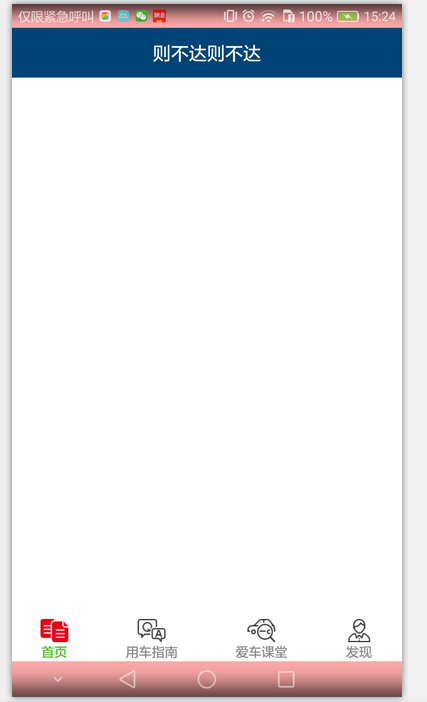

# SystembarTint

github地址：https://github.com/cowthan/AyoCompoment

## 7 状态栏一体化

```
注意，这两个方法总是得一块用，不要单独用
///status bar和navigate bar的颜色，如果是浅色，还需要配合SystamBarExtra里的方法加以优化，但不支持三星手机
getAgent().renderSystemBar(Color.YELLOW, Color.GREEN);
///status bar和navigate bar是否被侵占
getAgent().enableSystemBarTakenByContent(false);


这两个方法其实是对应着主题里的：
<item name="colorPrimary">@color/colorPrimary</item>
<item name="colorPrimaryDark">@color/colorPrimaryDark</item>
<item name="colorAccent">@color/colorAccent</item>
和布局里的：
fitSystemWindow="true"

当然，代码里设置的优先级比较高
```

下面多说点，systembar涉及到两个问题：
- 问题1：颜色设置，可以开启和关闭，分status bar和navigation bar
- 问题2：是否侵入，可以开启和关闭，和颜色设置不冲突

代码：
```java
@Override
protected void onCreate(Bundle savedInstanceState) {
    super.onCreate(savedInstanceState);
    setContentView(R.layout.sample_ac_main);

    //关闭StatusBar和NavigationBar侵入
    getAgent().enableSystemBarTakenByContent(false);

    //给StatusBar和NavigaionBar染色
    getAgent().renderSystemBar(Color.parseColor("#55ff0000"), Color.parseColor("#55ff0000"));

}

```

* 解析：
    * 这里就是对开源代码SystemBarTintManager的简单封装
    * enableSystemBarTakenByContent其实就是设置根布局的`android:fitsSystemWindows`属性


fitSystemWindows是true时：enableSystemBarTakenByContent(false)，内容给SystemBar留空


fitSystemWindows是false时：enableSystemBarTakenByContent(true)，内容侵入SystemBar


其他问题：
- 关于clipToPadding和clipToChildren：默认都为true
- http://www.jcodecraeer.com/a/anzhuokaifa/androidkaifa/2015/0317/2613.html
- 好像和滚动有关，可以上下滚动时，内容是否可以滚动到标题栏里

```
<ListView
    android:layout_gravity="center_vertical"
    android:id="@+id/list"
    android:clipChildren="false"
    android:clipToPadding="false"
    android:paddingTop="50dip"
    android:layout_width="match_parent"
    android:layout_height="match_parent" />
```

ListView初始化之后，由于top的50dp的padding，看似顶着标题栏，但往上滚动时，内容就会跑到padding的50dp里，也就能从标题栏看到了（如果标题栏带透明）


实际用例，还得考虑systembar的背景变成浅色时，字体颜色的问题，但三星手机好像不太支持状态栏背景浅色（会变成灰色代替）
```java
public static void breakerSystemBar(AyoActivity a){
    a.agent.enableSystemBarTakenByContent(false);
    a.agent.renderSystemBar(Color.WHITE, Color.WHITE);

    /// 下面这三个控制状态栏字体颜色，分别管：6.0， MIUI，魅族系统----当systembar的背景被设置成浅色，字体就得变成深色（一般情况下背景是深色，字体默认是浅色）
    if (Build.VERSION.SDK_INT >= Build.VERSION_CODES.M) {
        a.getWindow().getDecorView().setSystemUiVisibility( View.SYSTEM_UI_FLAG_LAYOUT_FULLSCREEN|View.SYSTEM_UI_FLAG_LIGHT_STATUS_BAR);
    }
    MIUISetStatusBarLightMode(a.getWindow(), true);
    FlymeSetStatusBarLightMode(a.getWindow(), true);

}

public static boolean MIUISetStatusBarLightMode(Window window, boolean dark) {
    boolean result = false;
    if (window != null) {
        Class clazz = window.getClass();
        try {
            int darkModeFlag = 0;
            Class layoutParams = Class.forName("android.view.MiuiWindowManager$LayoutParams");
            Field field = layoutParams.getField("EXTRA_FLAG_STATUS_BAR_DARK_MODE");
            darkModeFlag = field.getInt(layoutParams);
            Method extraFlagField = clazz.getMethod("setExtraFlags", int.class, int.class);
            if(dark){
                extraFlagField.invoke(window,darkModeFlag,darkModeFlag);//状态栏透明且黑色字体
            }else{
                extraFlagField.invoke(window, 0, darkModeFlag);//清除黑色字体
            }
            result=true;
        }catch (Exception e){

        }
    }
    return result;
}

public static boolean FlymeSetStatusBarLightMode(Window window, boolean dark) {
    boolean result = false;
    if (window != null) {
        try {
            WindowManager.LayoutParams lp = window.getAttributes();
            Field darkFlag = WindowManager.LayoutParams.class
                    .getDeclaredField("MEIZU_FLAG_DARK_STATUS_BAR_ICON");
            Field meizuFlags = WindowManager.LayoutParams.class
                    .getDeclaredField("meizuFlags");
            darkFlag.setAccessible(true);
            meizuFlags.setAccessible(true);
            int bit = darkFlag.getInt(null);
            int value = meizuFlags.getInt(lp);
            if (dark) {
                value |= bit;
            } else {
                value &= ~bit;
            }
            meizuFlags.setInt(lp, value);
            window.setAttributes(lp);
            result = true;
        } catch (Exception e) {

        }
    }
    return result;
}
```